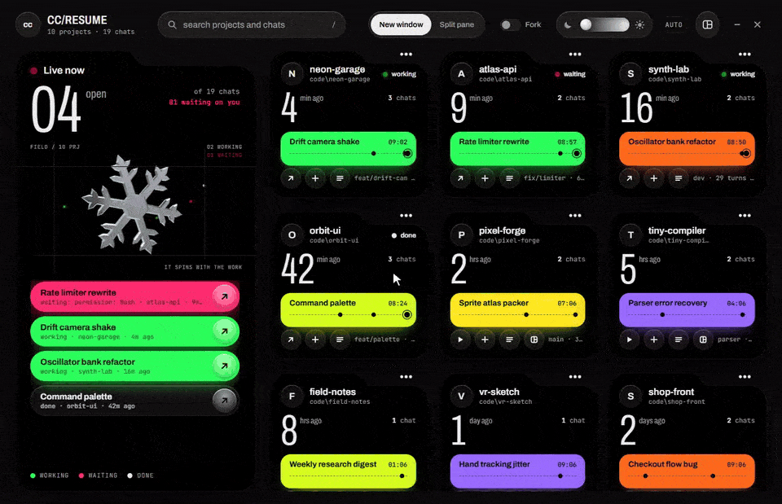
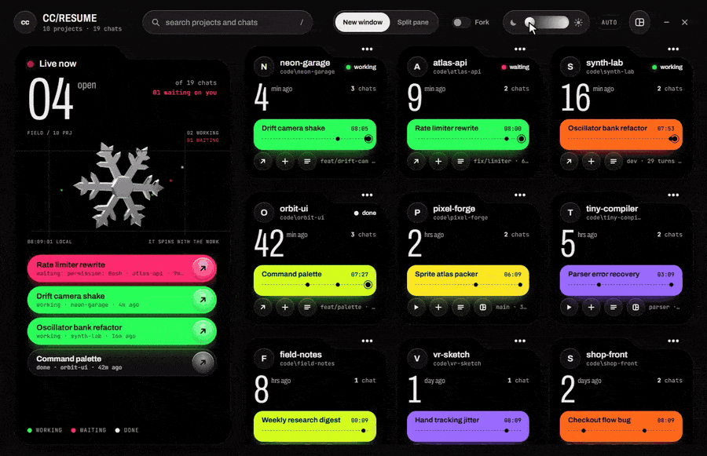

<p align="center">
  
</p>

<p align="center">
  <b>Windows 10 / 11</b> &nbsp;·&nbsp; Windows Terminal &nbsp;·&nbsp; Tauri 2 + Rust &nbsp;·&nbsp; MIT
</p>

---

Claude Code keeps every chat you've ever had. Getting back into one is the annoying part: `claude -r` and `claude -c` only see the chats started in the folder you're standing in. Start one in a subfolder, run nine sessions across thirty projects, and half your day goes to `cd`-ing around trying to remember where that one conversation lived.

**CC/RESUME** sits in the tray, knows every chat on the machine, and puts any of them back in its own terminal, in the right folder, with one click.

<p align="center">
  
</p>

## What it does

- **Every chat, every folder.** Read straight from Claude Code's own transcripts, grouped by project, newest first. A chat opens in the folder it was started in, so `--resume` just works.
- **Live, not guessed.** Which chats are running right now, which are working, and which are **waiting on you** (with the reason, like a permission prompt). The tray icon turns pink when something needs you.
- **Never twice.** Resuming a chat that's already open would make two terminals write into one transcript, so a running chat is a jump to its window instead. Flip **Fork** when you do want a copy.
- **Own window or split pane.** Each chat gets a window of its own, or splits the window you used last.
- **Desks.** Pick a few chats, drag them where you want them, choose a shape, and open them all tiled in one Windows Terminal window. Every launch is kept as a recent desk; name one to keep it for good.
- **Keeps your chats.** Claude Code deletes chats after 30 days by default. CC/RESUME offers to keep them for a year instead, and backs up your settings before it touches them.
- **Always one key away.** `Ctrl+Alt+Space` from anywhere, starts with Windows, closes to the tray.

## Desks

Put the chats you work on together side by side, and get the same layout back tomorrow.

<p align="center">
  
  <br><sub>Recorded on a demo machine: made-up projects and chats.</sub>
</p>

Pick chats from the cards (or add them from the list), hit **Arrange**, and the bench shows the window exactly as it will open. Drag a pane onto another to swap them, pick **Grid**, **Main + stack**, **Columns** or **Rows**, and **Open together**. The app opens on whichever view you used last.

If a chat on a desk is already running (or its transcript is gone), it's left out and its neighbours take the room.

## Dark, light, and everything between

The theme isn't a switch. It's a dimmer: drag it anywhere from black to paper and the whole UI blends with it, or let it follow Windows.

<p align="center">
  
</p>

## Install

1. Grab `CC-Resume_x.y.z_x64-setup.exe` from [**Releases**](https://github.com/Jyhed/cc-resume/releases/latest) and run it.
2. The installer isn't code-signed yet, so Windows SmartScreen may say it *protected your PC*. Click **More info → Run anyway**.

You need **Windows Terminal** (it ships with Windows 11; on Windows 10 get it from the Microsoft Store) and **Claude Code**, native or npm install. Chats open in your default Windows Terminal profile, with your shell, font and colours.

## Keys

| Key | Does |
| --- | --- |
| `Ctrl+Alt+Space` | Show or hide CC/RESUME, from anywhere |
| `/` or just start typing | Search projects and chats |
| `←` `↑` `→` `↓` | Move between cards |
| `Enter` | Open a project's chats |
| `Ctrl+Enter` | Resume the project's latest chat straight away |
| `Space` | Pick a chat to open together (in a project's list) |
| `Alt+Enter` | Open the picked chats together |
| `Enter` in search, on Desks | Add the top match to the desk |
| `Esc` | Close, clear the search, go back to chats, then hide to the tray |

## How it works

- **Chats** come from `~/.claude/projects/*/*.jsonl`, read incrementally and cached, and watched for changes. The folder a chat belongs to is the first working directory in its transcript.
- **Live states** come from `claude agents --json`, Claude Code's own scripting interface, re-read whenever the session registry in `~/.claude/sessions` changes.
- **Launching** is one `wt` call. A desk is a layout tree the page draws and the Rust side turns into `split-pane` and `focus-pane` steps.
- **Environment.** Every terminal the app opens gets your environment fresh from Windows, the same one a terminal opened from the Start menu would get, so a new PATH entry or key you set later is there without restarting anything.
- **Jumping** to a running chat finds its Windows Terminal tab by title through UI Automation.
- **Private.** Nothing leaves your machine. The app makes no network requests; its settings live in `%LOCALAPPDATA%\com.jihed.ccresume`.

## Build it yourself

You need Rust (stable), Node 22+, and the [Tauri prerequisites](https://tauri.app/start/prerequisites/) for Windows.

```sh
npm install
npm run tauri dev      # the app, with hot reload
npm run tauri build    # the installer, in src-tauri/target/release/bundle/nsis
cargo test --manifest-path src-tauri/Cargo.toml
```

Working on the UI only? `npm run dev` opens it in a plain browser on a made-up machine (`demo/snapshot.js`), no app needed. To preview your own chats instead, write them out once with `src-tauri/target/debug/cc-resume.exe --dump-snapshot .dev/snapshot.json` (after a `tauri dev` or `cargo build`) and reload; `CCR_DEMO=1 npm run dev` brings the demo back.

## Not yet

- Windows only, and Windows Terminal only.
- Jumping to an open chat relies on Claude Code's tab title format; if that changes, jumping needs an update (resuming keeps working).
- Other agents (Codex and friends) may come later.

## Credits

Built with [Tauri](https://tauri.app) and [three.js](https://threejs.org). Type is [Archivo](https://fonts.google.com/specimen/Archivo) and [JetBrains Mono](https://www.jetbrains.com/lp/mono/), both under the SIL Open Font License.

CC/RESUME is an independent project and isn't affiliated with or endorsed by Anthropic. Claude and Claude Code are trademarks of Anthropic.

<p align="center"><sub>MIT © 2026 Jihed Jarboui</sub></p>
